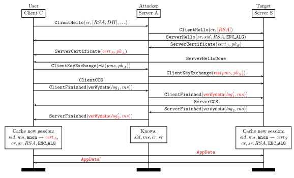
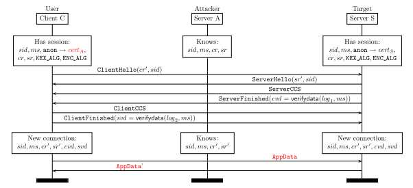
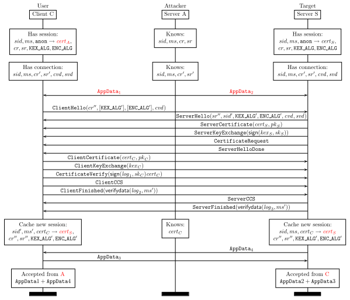
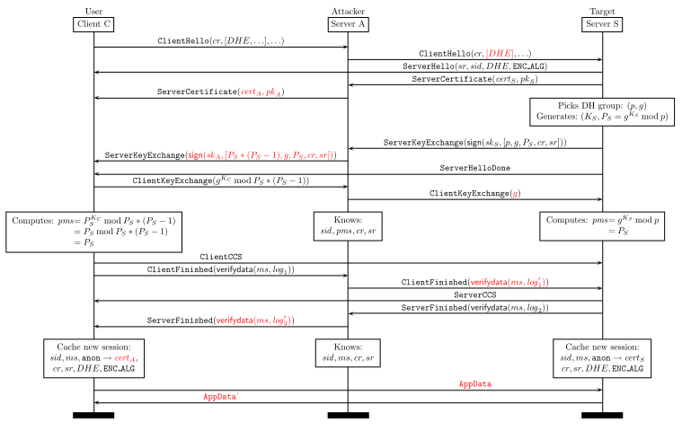
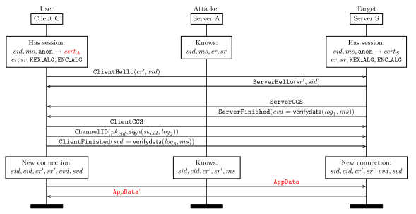

# Triple Handshakes Considered Harmful: Breaking and Fixing Authentication over TLS

> NOTE: The origin of this page is https://www.mitls.org/pages/attacks/3SHAKE which is not longer
> available.  This Markdown version was converted from an HTLM version obtained from the Way Back Machine from
> 4th August 2025.

*Logo by [@Raed667](https://twitter.com/Raed667)*

Our [research paper](https://www.mitls.org/downloads/tlsauth.pdf) with more details on the attacks (see Sections 4-7) was presented at IEEE S&P (Oakland) in May, 2014.

## Introduction

We present a new class of attacks against applications that rely on the [TLS Internet Standard](http://www.ietf.org/rfc/rfc5246.txt) for securing their communications. In contrast with recent attacks that rely on implementation errors, our attacks follow from the unexpected composition of standard features of the protocol: session resumption followed by client authentication during renegotiation. We propose short-term application-level mitigations, and we propose protocol-level changes to strengthen the standard and its users against such attacks.

To summarize the attacks briefly, if a TLS client connects to a malicious server and presents a client credential, the server can then impersonate the client at any other server that accepts the same credential. Concretely, the malicious server performs a man-in-the-middle attack on three successive handshakes between the honest client and server, and succeeds in impersonating the client on the third handshake.

We have confirmed that our attacks can be mounted on popular web browsers and HTTPS libraries, when they are used to perform certificate-based authentication at servers that enable both resumption and renegotiation. Variations of the attack (that do not rely on renegotiation) can be used to impersonate other TLS-based authentication mechanisms such as [PEAP](http://tools.ietf.org/html/draft-josefsson-pppext-eap-tls-eap-10), SASL ([SCRAM](http://tools.ietf.org/html/rfc5802), [GS2](http://tools.ietf.org/html/rfc5801)), and [Channel ID](http://tools.ietf.org/html/draft-balfanz-tls-channelid-01).

Our attacks are reminiscent of the renegotiation attacks of 2009 [[Ray](http://www.educatedguesswork.org/2009/11/understanding_the_tls_renegoti.html), [Rex](http://www.ietf.org/mail-archive/web/tls/current/msg03928.html)], but they bypass the protections introduced in [RFC 5746](http://tools.ietf.org/html/rfc5746) following their disclosure. Intuitively, these previous attacks exploited the lack of cryptographic binding between two handshakes on the same connection, whereas our attacks exploit a lack of cross-connection binding when TLS sessions are resumed on new connections. Moreover, our attacks do not require an active network adversary but can be mounted only with a malicious server or website. Our attacks also bear similarity to the man-in-the-middle attacks of 2003 on various EAP protocols [[Asokan et al.](http://asokan.org/asokan/research/Cambridge_SecProt_2003.pdf)]; again, our attacks circumvent the [countermeasures](http://tools.ietf.org/html/draft-puthenkulam-eap-binding-04) introduced in response to those attacks.

We first describe the core weaknesses in TLS that make our attacks possible and then describe the triple handshake attack in more detail. We suggest short-term mitigations at the application level and long-term fixes to the protocol in the form of a protocol extension to all versions of TLS and DTLS. We mention a few vulnerable applications with vendor responses; we maintain a larger list of affected software that have not yet been fixed, and in the interest of responsible disclosure, we do not name them here.

The triple handshake attack was originally found by Antoine Delignat-Lavaud, Karthikeyan Bhargavan and Alfredo Pironti from the [Prosecco](http://prosecco.inria.fr/) research team at [INRIA Paris-Rocquencourt](http://www.inria.fr/en/centre/paris-rocquencourt). This work is part of the [miTLS](http://mitls.org/) research project, aimed at building and verifying a reference TLS implementation.

For more details on the attacks, read our [research paper](https://www.mitls.org/pages/attacks/tlsauth.pdf) (esp. Sections 4-7). For other research papers and security theorems about our verified TLS implementation see [the miTLS homepage](http://mitls.org/).

## TLS Protocol Weaknesses

We identify four vulnerable features of the TLS protocol:

1. In the RSA handshake, a client *C* sends the pre-master secret (PMS) to a server *A* encrypted under *A*'s public key. If *A* is malicious, it can then (acting as a client) send the same PMS on a new connection to a different server *S*. The two connections can be further synchronized, because *A* can also use the same client and server random values and session identifier (SID) on both connections and thus obtain two sessions that share the same identifier, master secret (MS) and connection keys, but are between different pairs of principals; notably, the server certificate differs. In key exchange terminology, this is an *unknown key-share attack* (UKS); by itself it is not a serious vulnerability, but we amplify it below.

2. In the DHE handshake, the server *A* gets to choose the Diffie-Hellman group parameters. If *A* is malicious, it can choose a non-prime group such that the resulting PMS is fully under its control. Consequently, like with RSA, *A* can mount a man-in-the-middle attack between a client *C* and server *S* to obtain two sessions that share the same SID, MS, and connection keys (another UKS attack).

3. Session resumption on a new connection uses an abbreviated handshake that only verifies that the client and server share the same MS, ciphersuite, and SID (or server-issued session ticket, if used). Notably, it does not reauthenticate the client and server identities. Hence, if a malicious server *A* mounts a UKS attack to obtain two sessions (one with *C* and the other with *S*) that share the same MS, ciphersuite, and SID, it can forward the abbreviated handshake unchanged from one connection to the other. Notably, the abbreviated handshake log provides no guarantees that the original handshakes were the same. The secure renegotiation indication extension only binds handshakes on the same connection, but does not apply if the session is resumed on a new connection.

4. During renegotiation, both the server and client certificates can change. This is allowed by TLS (and supported in its main implementations) but no definitive guidance is given to applications on how to deal with such changes. Some implementations associate a connection with the first certificate, others with the last, but neither of these may be the best choice.

## Triple Handshake Attack

We describe the attack on a client *C* and server *S* that enable the RSA key exchange and support both resumption and renegotiation. The server is willing to accept connections from clients that are initially unauthenticated but subsequently use certificate-based authentication during renegotiation. (Other variations of the attack below apply if the client and server use DHE or always force client authentication.)

The attack proceeds in three steps.

In step 1 (shown in the protocol diagram below), the TLS client *C* deliberately connects to a server *A*, not knowing that *A* is malicious. Then, *A* connects, as a client, to *S* using the same client random (*cr*), and forwards *S*'s server random (*sr*) and SID to *C*. Moreover, *A* forces *C* and *S* to use the RSA key exchange by only offering the corresponding ciphersuites in the two handshakes. Then, *A* takes the encrypted PMS sent by *C* and reencrypts it to *S*. It completes both handshakes to obtain a new session on each connection; these two sessions share the same key materials and session parameters (*sid*, *ms*, *cr*, *sr*), but have different server certificates and finished messages (`verify_data`).

In step 2, *C* reconnects to *A* and asks to resume its previous session. *A*, in turn, reconnects to *S* and resumes its previous session as well. Since all the relevant parameters on the two sessions are the same, *A* can in fact simply forward the abbreviated handshake messages unchanged between *C* and *S*. On completion of the abbreviated handshake, the two connections again have the same keys, but now they also have the same finished messages (`verify_data`). *A* knows the new connection keys, so it can continue to send data on either connection towards *C* or *S*.

At this point, *C* still believes it has a connection with *A*, and *S* still believes that it has a connection with some anonymous client, so neither of them has been impersonated yet. However, since the client and server `verify_data` are now the same on both connections, the Renegotiation Indication extension for the next handshakes on these connections will have the same values. Notably, the `tls-unique` channel binding on the two connections is also now the same, contradicting its intended definition.

In step 3, *S* demands renegotiation with client authentication on its connection with *A*, possibly in response to *A*'s request for some restricted resource. Then, *A* forwards the renegotiation request to *C*, and *C* agrees to authenticate with its client certificate at *A*. Now, both connections engage in a full renegotiation handshake with client authentication. *A* simply forwards all messages from *C* to *S* and back. The handshake completes successfully, since the expected Renegotiation Indication extension values on both connections are the same.

At the end of renegotiation, *A* no longer knows the connection keys or master secret; they are known only to *C* and *S*. Consequently, *A* cannot read or send messages on these connections any more. However, its prior messages on both connections may well be prefixed to the messages sent after renegotiation. Moreover, as we show below in the web exploit, *A* will may still be able to read and write data into these connections by relying on the same origin policy.

During the renegotiation handshake, *C* receives a certificate for *S* even though it was expecting to be connected to *A*. We originally believed that *C* would refuse this certificate change, but we were surprised to find that a number of TLS client applications, including popular web browsers, silently allow the server certificate to change without providing any warning to their users. The design rationale for this is presumably to allow the server to renegotiate a different ciphersuite (e.g. ECDSA after RSA) or to allow a server to replace its expired certificate in a long-running TLS session, or to simply replace a generic (weak) certificate with a specific (strong) one. In more privacy-conscious scenarios, clients may want to allow the server to negotiate an initial handshake with anonymous credentials and then provide the real server certificate during renegotiation. Still, in the majority of cases, and especially in web scenarios, we believe TLS clients should refuse any server certificate changes during renegotiation.

## Web Exploits

At the end of the three steps of the triple handshake attack, the client *C* still believes it is connected to *A*, but is instead communicating over a client-authenticated channel with *S*. This confusion results in a variety of attacks, where *C* may unwittingly reveal to *A* sensitive data sent by *S* or *C* may enable *A* to tamper with messages sent from *C* to *S*.

A typical example is when *C* is a web browser and both *A* and *S* are websites.

- *A* can send a partial POST message to *S* before step 3 which gets retroactively authenticated by *C*'s certificate during renegotiation.
- *A* can inject JavaScript to *C* before step 3 which then gets executed in the authenticated session after renegotiation.
- *A* can source a client-authenticated page from *S* in one frame at *C* while reading its contents from another frame sourced at *A*, relying on the same origin policy.

The video below demonstrates the triple handshake attack on an example client and server. The target server `victim.ht.vc` allows anonymous browsing until the user clicks on `/login`, at which point the server sends a renegotiation request message with mandatory client authentication before displaying any sensitive user information (in practice, the target server is typically a banking or certification authority website).

When a user visits the attacker's website (e.g. `mitls.org`), the adversary implements the 3-step attack described above to impersonate the client using the client's certificate at the target server `victim.ht.vc`. Note that the attacker website does not pretend to be the target server; it uses its own certificate, and the browser displays the attacker's URL. The attack is that the client-authenticated frame showing the user's sensitive content on `victim.ht.vc` can now be read and tampered with by a frame loaded from the attacker's website.

The demo assumes that the user is willing to use her client certificate on the attacker's website. It also assumes that the browser is willing to silently accept a change of server certificate during renegotiation, which is the case for many major browsers and non-browser TLS clients.

*[Video: Demonstration of triple handshake attack - https://www.mitls.org/v/renego.mp4]*

## Countermeasures

### Apply the same validation policy for all certificates received over a connection

As a short-term fix to our renegotiation attack, we propose that TLS clients should ensure that all certificates received over a connection are valid for the current server endpoint, and abort the handshake if they are not. In some usages, it may be simplest to refuse any change of certificates during renegotiation. This is our recommendation to all HTTPS libraries and web browsers.

Preventing certificate changes still would not prevent our man-in-the-middle attacks on PEAP, SASL, and Channel ID. Preventing those would require protocol changes, as suggested below

### Bind the master secret to the full handshake

*This proposal is detailed in an [Internet draft](https://tools.ietf.org/html/draft-ietf-tls-session-hash) submitted to the TLS IETF working group, and implemented in a [patch for OpenSSL](https://www.mitls.org/pages/attacks/downloads/OpenSSL1_0_1e-session_hash-extended_ms-secure_resumption.patch).*

We observe that the TLS master secret is often treated as a unique and secret session and authentication token. However, our attacks on the RSA and DHE key exchanges show that an attacker can easily create two different sessions with different identities sharing the same master secret.

We propose a TLS extension to strengthen the master secret derivation scheme by including a hash of the initial handshake messages in the PRF computation. This would prevent all our attacks, since the master secret would implicitly authenticate the client and server identities and all other session parameters, even during resumption.

### Bind the abbreviated session resumption handshake to the original full handshake

An alternative to strengthening the master secret is to strengthen the abbreviated handshake. We propose a secure resumption indication extension, along the lines of [RFC 5746](http://tools.ietf.org/html/rfc5746), where the client hello and server hello of an abbreviated handshake include the hash of the initial handshake messages that created the session.

This fix eliminates our attacks by providing strong cross-connection security guarantees. However, it still allows the same master secret on two different sessions, and may lead to other attacks on application-level mechanisms that use [key material exported from TLS](https://tools.ietf.org/html/rfc5705).

## Disclosure and Vendor Response

Our renegotiation attacks affect TLS implementations, major web browsers and servers, popular HTTPS client libraries, and some VPN applications. Other affected software includes TLS applications relying on SASL and PEAP, such as XMPP servers and WPA Enterprise networks. We maintain a partial list of affected products, and note here only those who have had enough time to plan and implement fixes. We invite software vendors to contact us if they would like us to discuss the applicability of our attacks to their products.

1. **Chromium** (Chrome,Opera,Android): notified October 15, 2013. Prevented server certificate from changing in [CVE-2013-6628](http://www.securityfocus.com/bid/63678)
2. **SChannel** (Internet Explorer): notified October 18, 2013. Prevented server certificate from changing in [CVE-2014-1771](https://technet.microsoft.com/library/security/ms14-035).
3. **NSS** (Chromium,Firefox): notified November 4, 2013. Prevented degenerate Diffie-Hellman public keys in [CVE-2014-1491](http://www.securityfocus.com/bid/65332). Firefox correctly checks server certificates during renegotiation.
4. **SecureTransport** (Safari, iOS): notified January 10, 2014. Vulnerable to a variant of the attack. Security update issued for iOS (APPLE-SA-2014-04-22-2), OS X (APPLE-SA-2014-04-22-1), Apple TV (APPLE-SA-2014-04-22-3) to prevent certificate changes during renegotiation: See [CVE-2014-1295](http://web.nvd.nist.gov/view/vuln/detail?vulnId=CVE-2014-1295).
5. **ChannelID** (Chromium): notified October 10, 2013. Security update to Chromium now limits ChannelID to ECDHE handshakes.
6. **TLS Channel Binding, SASL**: notified on October 23, 2013. Mitigations pending modification to `tls-unique` or adoption of new TLS extension
7. **OpenSSL, GnuTLS**: notified on October 20, 2013. Not directly affected, but applications using them usually are. Mitigations pending adoption of new TLS extension
8. **Java JSSE**: All versions from 1.5.0 to 1.8.0 are patched; see [CVE-2014-6457](http://web.nvd.nist.gov/view/vuln/detail?vulnId=CVE-2014-6457)
9. **RSA BSAFE**: EMC released updates to its SSL-J and Micro Edition Suite (EMC) products to prevent Triple Handshake attacks. See [ESA-2014-158](http://www.securityfocus.com/archive/1/534351/30/0) (CVE-2014-4630) for details.

## Other Attack Variants: DHE, Channel Bindings, Channel ID

### Initial DHE Handshake

In step 1 of the triple handshake attack, two connections are established respectively between a client *C* and the attacker *A*, and between the attacker *A* and a target server *S*. These two connections share the same key materials and some session parameters, but have different server certificates and finished messages.

In the text above, we showed how this attack works when both client and server enabled the RSA key exchange. If *C* and *S* only support a DHE key exchange, the attack is still possible, as long as the client is willing to accept an unknown Diffie-Hellman group from the attacker. The attacker can choose this group in a way that forces the client to compute a specific PMS. A protocol trace showing how the attacker can do this is shown below.

The client *C* connects to *A* and *A* connects to *S*, forcing DHE handshakes with matching the client and server randoms on both connections. When *S* sends its Diffie-Hellman group parameters (*p*,*g*) and public key *PS*, *A* sends to *C* a different group (*PS * (PS - 1)*, *g*). This group is carefully designed so that no matter what Diffie-Hellman key the client chooses, the resulting shared secret will be equal to *PS*. Subsequently, *A* sends the public key *g* to *S* and both connections will have the same PMS, MS, and connection keys.

A cursory look at the group parameters sent by *A* reveal that they describe an invalid Diffie-Hellman group. In fact, the *p* value is not even a prime (it is even). However, TLS allows the server to choose an arbitrary Diffie-Hellman group, and does not require the client to perform any validation on the received parameters. Even if the client rejected even values, we have simple variants of the attack that still work. More generally, none of the mainstream TLS implementations performs a primality test, for example, since it is considered too computationally expensive. We instead recommend that a set of well-known good groups be standardized for use in DHE, much like only named curves are used in implementations of ECDHE.

### Impact on Tunneled Authentication (PEAP, EAP-TTLS)

Tunneled authentication protocols like PEAP and EAP-TTLS are used in wireless networks to authenticate clients before granting them network access. These protocols first establish a TLS connection and then perform an EAP authentication protocol within the tunnel. In 2003, [Asokan et al.](http://asokan.org/asokan/research/Cambridge_SecProt_2003.pdf) demonstrated that these protocols were vulnerable to a general class of man-in-the-middle attacks, since the inner EAP authentication protocol was not cryptographically bound to the outer TLS channel. In response, they proposed a few [countermeasures](http://tools.ietf.org/html/draft-puthenkulam-eap-binding-04) which were adopted in new versions of PEAP and related protocols.

These countermeasures sought to cryptographically bind the key material generated in the inner and outer protocols. In particular, the EAP client and server must prove to each other that they also agree upon the TLS master secret and client and server randoms. However, this countermeasure only works if the master secret on two different connections cannot be the same. In our triple handshake attack, the master secret on the two connections *C-A* and *A-S* is already the same after the first handshake. As a result, any EAP authentication tunneled within TLS can still be impersonated using our attacks. By exploiting a combination of an initial handshake and *fast reconnect* (session resumption), our man-in-the-middle attacker can hijack the connection between an EAP user and the server.

We are still in the process of testing various EAP clients and servers for these attacks; concrete details and vendor responses will be added to this page in due course.

### Impact on TLS Channel Bindings (SASL-SCRAM, SASL-GS2)

[TLS Channel Bindings](http://tools.ietf.org/html/rfc5929) are used to expose a value (uniquely) associated with the current TLS connection (specifically the most recent handshake) to the application. For example the `tls-unique` channel binding refers to the first Finished message in the innermost handshake on the current connection, and hence by checking that this value matches on the client and server, they can presumably be assured that their communications are over the same connection. This is for instance used in the [SCRAM](https://tools.ietf.org/html/rfc5802) SASL mechanism to prevent man-in-the-middle attacks on the challenge-response exchange.

Such [uses of channel bindings](http://tools.ietf.org/html/rfc5056) for linking application-layer authentication to transport layer security requires that a man-in-the-middle should not be able to force the `tls-unique` channel binding to be the same on two different connections.

However, as our triple handshake attack shows, at the end of the step 2 (resumption), the attacker *A* can indeed create ensure that the `tls-unique` binding on two different connections is the same. At this point, if the client *C* were to agree to authenticate to the attacker *A* using an authentication protocol like SCRAM or GS2, the attacker could forward its messages to the server and hence impersonate the client. One may argue that the client should refuse to provide its password-based credential to the attacker's server, but this is exactly the kind of man-in-the-middle attack that channel binding was meant to prevent.

We also note that at the end of step 3 (renegotiation), even the `tls-server-endpoint` channel binding becomes the same, so adding this channel binding to the application-level protocol would not help.

### Impact on Channel ID

[Channel ID](http://tools.ietf.org/html/draft-balfanz-tls-channelid-01) is a proposed extension to associate a client-stored long-lived key pair associated to each domain name a TLS client connects to whose public key is sent along with every handshake to that domain (signed with the private key). One of the goal is to bind application-level credentials (such as cookies) to this public key to make the application session unusable on a different client.

The security guarantees of Channel ID can be bypassed only using resumption of a session negotiated with the attacker, because it only authenticates the log of the resumption handshake, which does not contain enough information to correlate the identity of the server.

For instance, assume that a network attacker got the user's cookie on *S* but it is protected with *C*'s Channel ID public key (this can be achieve by adding *HMACk(c,pkcid)* to the cookie value *c* where *k* is a secret key stored on the server and *pkcid* is the Channel ID public key for *S*). Furthermore, assume that *C* is willing to cache a session that corresponds to an invalid certificate (but not to send any data on this connection), as is the case on the only browser that currently implements Channel ID. Then, the attacker is able to control a session with *S* associated with *C*'s Channel ID:

Similarly, the attacker can inject a login request on the resumed session to get a valid cookie associated with *C*'s Channel ID and *A*'s credentials that *A* can force on *C* to perform login CSRF attacks.

---

